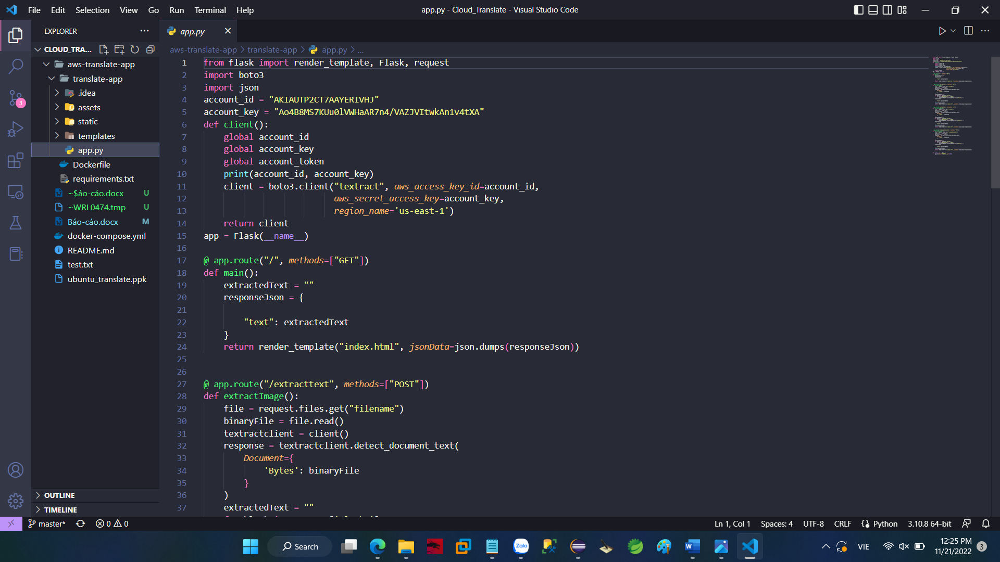
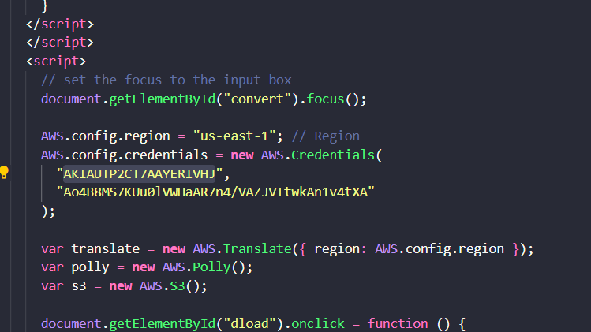

# CloudComputing

## Đề tài: Tìm hiểu Amazon Translate và viết ứng dụng minh họa

        Trần Nguyễn Huy Trường    - 20110590
        Nguyễn Phước Công         - 20110447
        Nguyễn Nhật Tính          - 20110576

## Các dịch vụ sử dụng

- AWS Translate
- AWS Polly
- AWS Textract

### Chuẩn bị

- Tài khoản AWS có đăng ký dịch vụ IAM User
- Tạo user mới bằng IAM , đăng kí dịch vụ Translate , Polly và và ghi nhớ aws_access_key_id, aws_secret_access_key để cấu hình cho website

### Cài đặt

- Bước 1: Clone project về máy https://github.com/truongtnh7522/Cloud_Translate.git .

- Bước 2: Chỉnh sửa lại key trong app.py và index.html 

- Bước 3: pip install flask 

- Bước 4: pip install boto3

- Bước 5: pip install gunicorn 

- Bước 6: Chạy file app.py
